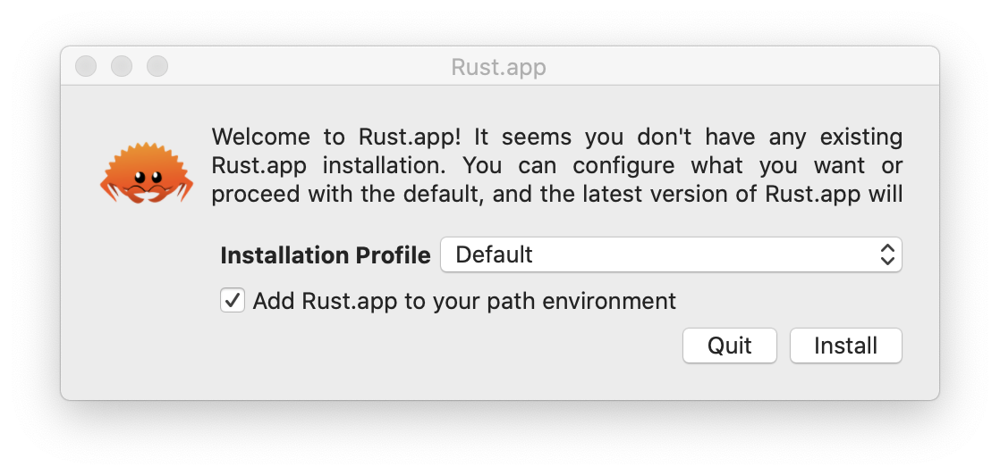
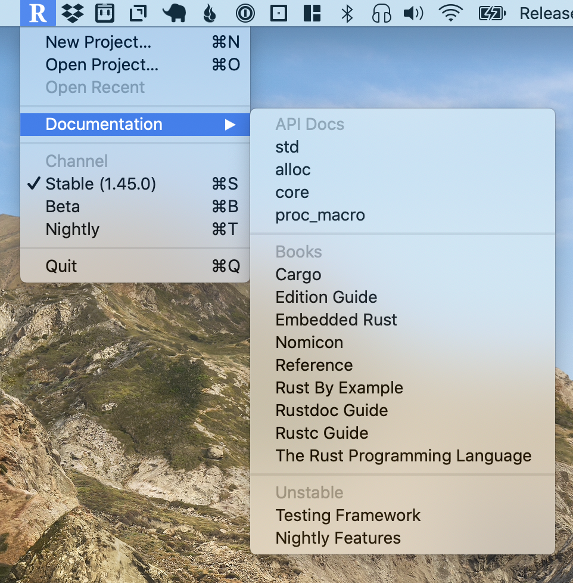

# Rust.app 🦀 🖥
Rust.app is a **unofficial** statusbar app for Rust & macOS. It provides an easy installation
experience for Rust as well as some handy developer utilities through its statusbar menu.

## Features

- **Easy Installation** — Installing Rust now just as easy as any other macOS app.
- **Companion Statusbar App** — A optional statusbar app that provides you
  with extra developer utilities to help you with Rust.
  - **Create/Open Cargo Projects** — The `New Project…`/`Open Project…` commands
    will respect your macOS system app preference for opening Rust code.
  - **Documentation Menu** — Have you ever wanted to open the `std` documentation
    only to be in a spotty connection and not be able to open the docs? Rust.app will
    automatically detect when it can reach `doc.rust-lang.org` and open a local
    version instead.

## Platform Support

- macOS 10.15+

## Screenshots

